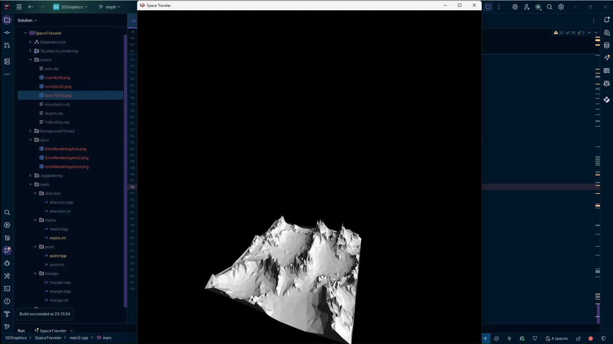

# SpaceTraveler - 3D Rendering Engine

A comprehensive 3D rendering engine developed from the ground up in C++ to demonstrate fundamental computer graphics principles, linear algebra operations, and real-time rendering techniques.

## Project Overview

SpaceTraveler represents a deep dive into 3D graphics programming, implementing core rendering algorithms without relying on high-level graphics APIs. The engine demonstrates mathematical foundations of computer graphics through custom implementations of matrix transformations, vector operations, and lighting calculations.

## Core Features

- **Custom 3D Renderer**: Complete rendering pipeline built from mathematical primitives
- **Real-time Lighting System**: Dynamic light simulation with proper shading calculations  
- **Linear Algebra Library**: Full implementation of matrix and vector mathematics
- **Camera System**: 3D camera with mouse and keyboard controls for scene navigation
- **3D Model Support**: .obj file format loading and rendering capabilities
- **Cross-platform Architecture**: Built using SFML framework for portability

## Technical Implementation

**Programming Language**: C++  
**Graphics Framework**: SFML (Simple and Fast Multimedia Library)  
**Build System**: CMake compatible  
**Mathematics**: Custom linear algebra implementation  

## Demo

*3D rendering engine showing real-time lighting and camera movement*

## Educational Resources

This project was developed following a comprehensive tutorial series on 3D graphics programming:

**Tutorial Series**: [3D Graphics Engine from Scratch](https://www.youtube.com/watch?v=ih20l3pJoeU&list=PLrOv9FMX8xJE8NgepZR1etrsU63fDDGxO&index=22&ab_channel=javidx9)

**Reference Implementation**: [OneLoneCoder's 3D Engine](https://github.com/OneLoneCoder/Javidx9/tree/master/ConsoleGameEngine/BiggerProjects/Engine3D)

## Getting Started

### Prerequisites
- C++ compiler with C++17 support
- SFML library installed and configured
- CMake (optional, for build system)

### Build Instructions
1. Clone the repository
2. Ensure SFML dependencies are properly linked
3. Compile using your preferred C++ build system
4. Execute the resulting binary to launch the 3D renderer

### Controls
- **WASD**: Camera movement
- **Mouse**: Look around (camera rotation)
- **Arrow Keys**: Additional camera positioning

---

*This project serves as an educational exploration of 3D graphics programming fundamentals and computer graphics mathematics.*
